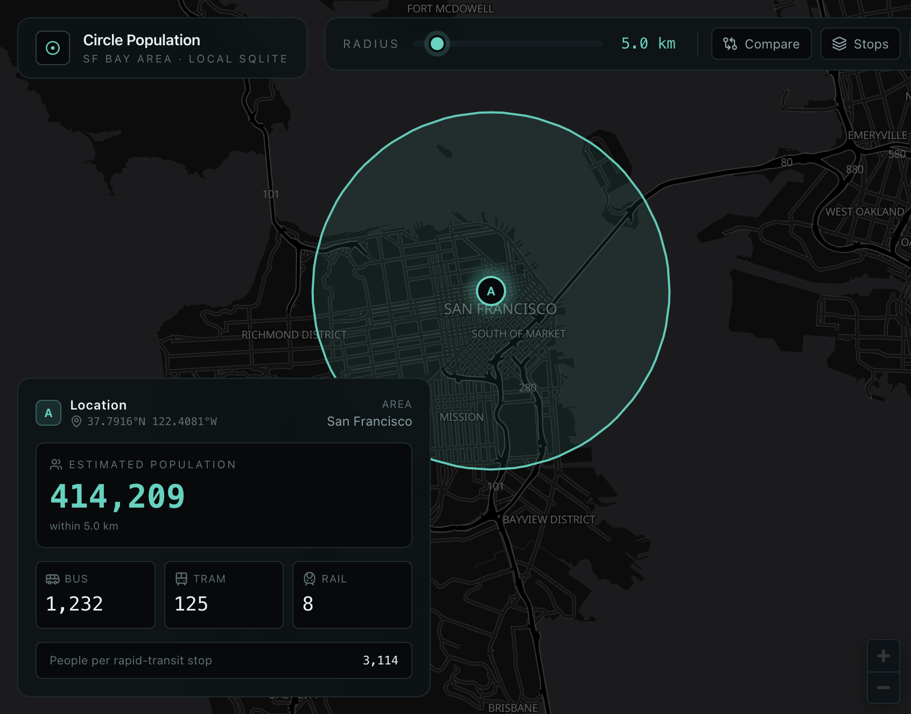
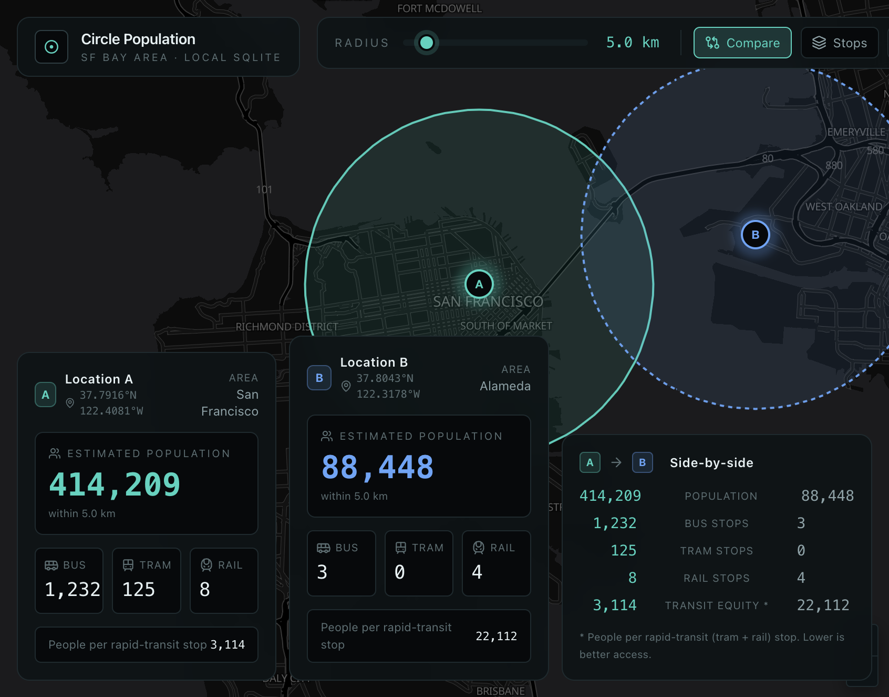
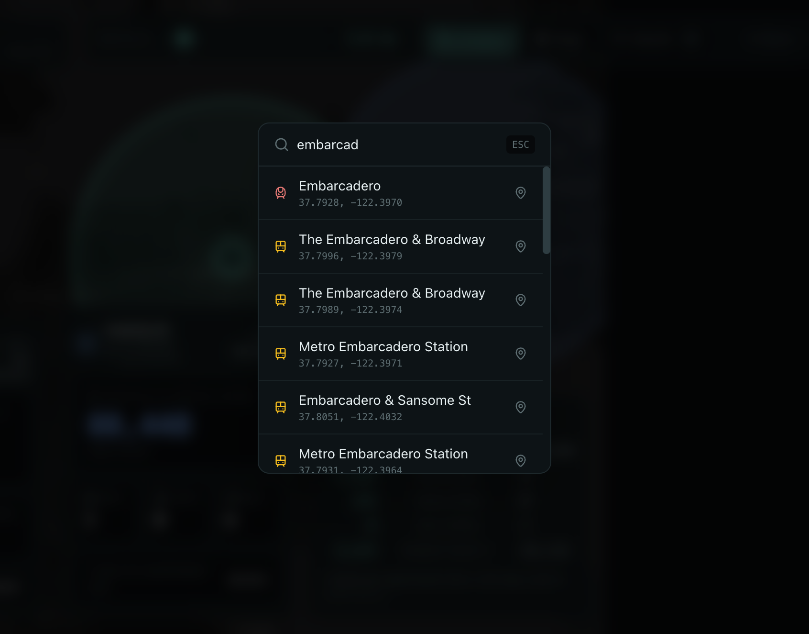

# Circle Population: SF Bay Area

A take-home for Mariana Minerals. Click a point on a map of the SF Bay Area, get the population and the bus / tram / rail stop counts inside a circle around it. Inspired by Tom Forth's [Population around a point](https://www.tomforth.co.uk/circlepopulations/), but scoped to NorCal and driven by a local SQLite DB instead of a hosted API.



## Running it

```bash
git clone <repo>
cd circle-population
npm install
npm run build:db   # builds db/circle.sqlite from data/ and data/raw/  (~12s)
npm run dev        # vite on :5173, hono api on :8787 (proxied through vite)
```

Open http://localhost:5173. Click somewhere on the map. Drag the radius slider. The rest is in the UI.

The DB build works offline. I committed the source data (`data/bg_pop.csv` plus the three GTFS zips, ~10 MB total) so you don't need a network on first run. If you want to refresh from upstream:

```bash
rm -rf data/raw && npm run download:data    # refetch GTFS feeds
rm data/bg_pop.csv && npm run build:db      # auto-refreshes Census via the unkeyed API (capped at 500 req/IP/day)
# Optional: pass CENSUS_API_KEY=... to lift the cap if you have one. No key required by default.
```

Production build (Hono serves the static dist + the API on one port):

```bash
npm run build && npm start   # both on :8787
```

## What I built

The required UX is there: a dark map of the Bay Area, click-to-place a point, radius slider (3–25 km, default 5), and a panel showing the estimated population and the bus / tram / rail counts inside the circle. The colors come straight off the Mariana Minerals site: near-black background, teal as the primary accent, blue as the secondary, white text.

For the "one feature of your own choosing," I added **Compare Mode**: pin location A, drop location B somewhere else, see both circles and side-by-side metrics. I picked this because nearly every piece of user feedback I found on similar tools (r/urbanplanning, r/sanfrancisco, the replies under Tom Forth's original) eventually boils down to "let me compare two places." It also gave me an excuse to surface a derived metric I'm calling **Transit Equity Score**, computed as `population / (tram + rail stops)`, i.e. people per rapid-transit stop. Lower is better access. In the demo screenshots, downtown SF works out to ~3,100 people/rapid-stop and the Alameda waterfront to ~22,000. That ~7× gap is a real, recognizable Bay Area story you can see in one click.

There's also a `⌘K` command palette that does prefix search over every transit stop name (FTS5 under the hood). Small QoL thing, motivated by the same forum feedback ("let me type 'Embarcadero' instead of panning").

## The stack

Frontend is Vite + React 19 + TypeScript, with Tailwind v4 driving the Mariana palette as CSS-first theme tokens. The map is MapLibre GL JS via `react-map-gl`, serving WebGL vector tiles from OpenFreeMap because it doesn't require an API key. TanStack Query handles fetch state, Zustand handles app state, Framer Motion does the panel transitions, Lucide for icons.

Backend is Hono on `@hono/node-server` (Express felt like overkill for three endpoints), `better-sqlite3` for the DB (synchronous API = no async overhead, exactly what you want for an in-process DB), and Zod for validating the query params.

ETL is plain TS scripts run with `tsx`. The only runtime deps are `csv-parse` and `adm-zip`.

## Where the data comes from

**Population:** US Census **ACS 2022 5-year**, table `B01003` (total population), via the public Census API. The block-group centroids (`CENTLAT` / `CENTLON`) come from a separate TIGERweb endpoint: `tigerWMS_ACS2022/MapServer/8`. The script auto-paginates because TIGER caps responses at 2,000 rows per query and a few of these counties have more block groups than that.

**Transit:** three GTFS feeds:

- **SFMTA** (Muni: bus + Muni Metro light rail): `https://muni-gtfs.apps.sfmta.com/data/muni_gtfs-current.zip`. The "canonical" `gtfs.sfmta.com` URL that's all over the SFMTA docs was actually dead when I tested, so I had to dig through the [Mobility Database](https://mobilitydata.org) catalog to find the current one (entry #2886). The download script falls back to a GCS-hosted Mobility Database mirror if the live URL times out, which it apparently sometimes does.
- **BART** (subway/metro): `https://www.bart.gov/dev/schedules/google_transit.zip`
- **Caltrain** (commuter rail), Trillium-hosted snapshot: `https://data.trilliumtransit.com/gtfs/caltrain-ca-us/caltrain-ca-us.zip`

**Basemap tiles:** OpenFreeMap's `dark` style.

Coverage works out to 12 California counties (the nine Bay Area counties plus Sacramento, San Joaquin, and Yolo), which is **6,664 block groups** and **3,209 transit stops** (2,836 bus / 293 tram / 80 rail) in a **1.6 MB** SQLite file.

## Schema

```
block_groups        (id, geoid, county, lat, lng, pop)
block_groups_rtree   R*Tree spatial index, one degenerate-bbox entry per centroid

stops               (id, stop_id, agency, name, lat, lng, category)
stops_rtree          R*Tree spatial index, one entry per stop
stops_fts            FTS5 (porter + unicode61) over stop names
```

The spatial query pattern for a circle at `(lat, lng)` with radius `r` km:

1. Compute an equirectangular bbox around the center.
2. Hit the R\*Tree to get candidates whose bboxes fall inside the query bbox.
3. Filter the candidates with an exact Haversine distance.

That collapses a full table scan into ~10–500 candidates at typical radii, which is what justifies the R\*Tree's existence in the schema.

For GTFS categorization I follow `stops → stop_times → trips → routes` to compute the set of `route_type`s that serve each stop, propagate child types up to `parent_station` so BART platforms inherit the route_types of their station, and emit one row per logical station. Mapping:

- `1` or `2` → **rail** (BART, Caltrain)
- `0` → **tram** (Muni Metro light rail)
- `3` or `11` → **bus** (regular + trolleybus)
- `4` (ferry) and `5` (cable car) are intentionally excluded. They're real transit but don't fit the brief's three buckets cleanly.

## Tradeoffs

**Centroid-based population.** I treat each block group's population as a point at its centroid and ask "is the centroid inside the circle?" This is fast and small (the whole DB is 1.6 MB), but it's lossy at the edges: a 3 km circle that partially overlaps a large outer Marin block group will either take all of its pop or none, with nothing in between. For dense areas like SF the groups are small enough that this error is invisible; for sprawl, it grows. The cleaner answer is polygon-area-weighted population, which means ingesting the actual block-group shapefiles and using something like `@turf/intersect`. That would roughly 5× the DB size and bump query times from sub-millisecond to ~10 ms, so I chose to flag the limitation here rather than implement it. If I had another half-day on this, that's the first thing I'd do.

**Equirectangular bbox.** Same reasoning. For 25 km circles at SF latitudes (~37.8°), the difference between a true geodesic bbox and a flat-earth approximation is a fraction of a degree, and the Haversine refinement corrects any over-inclusion exactly. At higher latitudes or much larger radii this would degrade.

**Stop de-duplication.** I dedup by `parent_station`, so a BART station with several platform `stop_id`s counts once. Muni surface light-rail stops mostly don't have parents (they're registered per block), so I left those as the agency declares them. The reasoning: the user-facing "tram stops within X km" should match what SFMTA itself reports about its own network, not some clustered abstraction.

## Known gaps

These are all permitted under the brief's "reasonable simplifications," but they're real and I'd want to fix them in v2:

- East Bay (AC Transit), Peninsula (SamTrans), and South Bay (VTA: bus + light rail) aren't ingested. A pin in Oakland correctly returns zero buses, but it visually reads as a bug for about three seconds before you realize it's a coverage gap. Adding those is roughly 10 minutes of work (append to the `feeds` array in `scripts/build-db.ts` and rerun) plus another ~20 MB of GTFS data.
- The "Area" label is just the county containing the closest block-group centroid. A pin in the Mission says "San Francisco," not "Mission District." A real reverse-geocode against TIGER place polygons would fix this.
- No URL persistence. Refreshing nukes both pins. `?a=lat,lng&b=lat,lng&r=5` would be the obvious next thing, and would make compare-mode results shareable.
- The Stops overlay caps at 2,000 markers per circle to keep the payload light. At 25 km radius in dense SF you can hit that cap silently.

## Layout

```
.
├── data/
│   ├── bg_pop.csv          # Census block-group centroids + pop (committed)
│   └── raw/                # GTFS zips (committed, ~9 MB)
├── db/                     # generated; .gitignored
├── docs/screenshots/
├── scripts/
│   ├── download-data.sh    # fetches GTFS zips
│   └── build-db.ts         # ETL → db/circle.sqlite
├── server/
│   ├── db.ts               # sqlite open + geo helpers
│   └── index.ts            # Hono /api/query, /api/stops, /api/search
└── src/
    ├── App.tsx
    ├── components/         # MapView, ControlBar, ResultsPanel, ComparePanel, CommandPalette
    └── lib/                # store / api / geo / format
```

## Screenshots

**Compare Mode**: two pins, side-by-side metrics, transit-equity ratio at the bottom of the third panel:



**Command palette** (`⌘K`). FTS5 prefix search across every transit stop. Rail stops are red, tram yellow, bus grey:



## License

Code is MIT. The data sources keep their respective open-data licenses (Census is public-domain; GTFS feeds are each agency's terms, all permissive).
